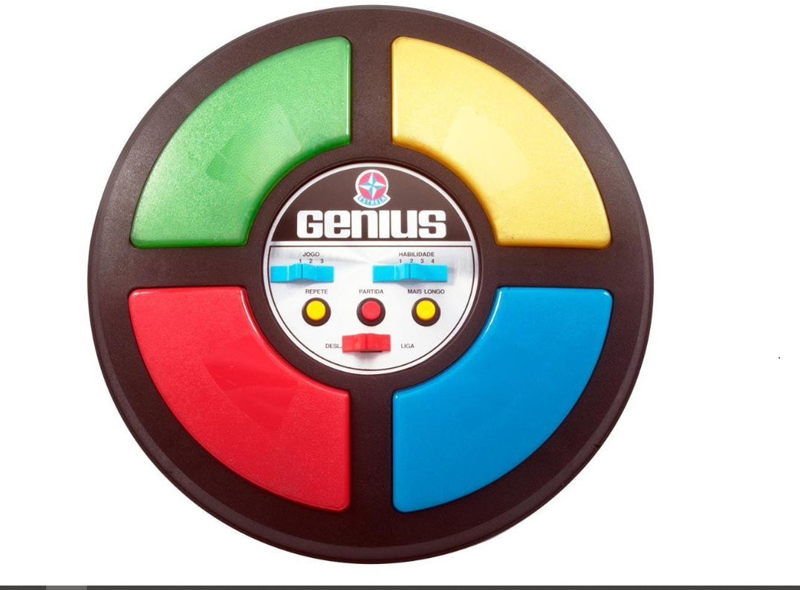

<h1 align="center"></h1>

<h1 align="center"> jogoGenius </h1>

 O brinquedo buscava estimular a memorização de cores e sons. Com um formato semelhante a um<strong> OVNI</strong>, possuía botões coloridos que emitiam sons harmônicos e se iluminavam em seqüência. Cabia aos jogadores repetir o processo sem errar.

<h2><strong>Histórico</strong></h2>

O Genius lançado em 1980 pela <strong>Estrela</strong> foi o primeiro jogo eletrônico vendido no Brasil, sendo a versão do Simon, do fabricante americano Hasbro. Muitos brinquedos eletrônicos da Estrela dos anos 80, como o Pégasus, Colossus, Gênius e outros, saíram de linha.

Em 1987, a Prosoft desenvolveu um Genius para MSX 1 O programa foi desenvolvido em Basic.
O Genius original possuía três jogos diferentes e quatro níveis de dificuldade.
Voltou a ser fabricado pela Estrela em 2012. 

Para jogar é só <a href="https://g-aleprojetos.github.io/jogoGenius/">clicar aqui.</a>

<a href="https://pt.wikipedia.org/wiki/Genius_(jogo)">font: wikipedia</a>
